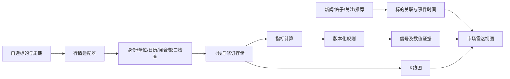

# Market Radar：市场行情与 K 线信号研究

核验日期：2026-10-03（Asia/Shanghai）。本文是下一阶段设计依据；当前网站 0.2 仍是资讯聚合平台，本文所述行情采集、指标、信号和图表尚未接入运行。

## 建议采用的组合

Market Radar 应增加独立的行情通道，与现有关键词资讯、账号关注和推荐通道并行。新闻和帖子提供事件线索；价格、成交量和波动提供可复核的市场变化。两者按标的和时间关联展示，但时间接近不能证明新闻导致价格变化。

首版建议：**CCXT 接加密行情，AKShare 接 A 股/港股历史数据，yfinance 接美股及部分港股历史数据，TA-Lib 计算指标，Lightweight Charts 展示 K 线与信号。** 股票先做日线，加密先做 1 小时线与小规模自选列表。股票盘中实时行情另选有权限的提供方，例如 Futu OpenD。这些 SDK 的代码许可不等于上游行情的实时性、完整历史或公开再分发授权。

| 组件 | 用在本项目中的位置 | 当前核验与限制 | 优先级 |
| --- | --- | --- | --- |
| [CCXT](https://github.com/ccxt/ccxt) | 加密现货/明确指定合约的 OHLCV；后续资金费率、持仓量 | 最新稳定 4.5.85；MIT；Python ≥3.10。按交易所检查能力。最后一根可能未闭合，历史覆盖与可访问性不同；CCXT Pro WebSocket 现已免费并在同一仓库 | 首版 |
| [AKShare](https://github.com/akfamily/akshare) | A 股/港股历史日线及按接口支持的其他行情 | 源码版本 1.19.1；MIT；Python ≥3.11。按具体函数区分市场、周期、复权、单位和来源；免费公开接口可能变动或不可访问 | 首版，先验证数据源 |
| [yfinance](https://github.com/ranaroussi/yfinance) | 美股历史日线、部分港股历史数据；快速本地原型 | 源码版本 1.7.0；Apache-2.0。Yahoo 数据用途另受上游条款约束；不是有 SLA 的全市场实时行情服务，分钟历史有窗口限制 | 首版本地研究 |
| [Futu API](https://github.com/FutunnOpen/py-futu-api) | 需要盘中行情时接港股/美股及权限允许的市场 | Python SDK Apache-2.0；需运行 OpenD、登录 Futu/moomoo 账号并具备对应 API 行情权限。当前官方政策允许未开户用户登录，不应写成必须证券开户；订阅与历史额度有限 | 第二阶段，可选 |
| [TA-Lib Python](https://github.com/TA-Lib/ta-lib-python) | MA/EMA、RSI、MACD、ATR 等数值指标 | 最新 0.8.1；Python 包 BSD-2-Clause，C 核心 BSD-3-Clause。支持的平台 wheel 包含 C 库；支持本项目 Python 3.12 与 macOS ARM64。需实际 lookback 和预热检查 | 首版 |
| [Lightweight Charts](https://github.com/tradingview/lightweight-charts) | K 线、成交量、指标与事件标记 | Apache-2.0 加 NOTICE/TradingView 署名要求；只提供图表，不提供 TradingView 行情。v5 使用 `addSeries(CandlestickSeries)` | 首版 |
| [backtesting.py](https://github.com/kernc/backtesting.py) | 独立离线验证小规模规则 | AGPL-3.0；轻量，支持手续费、价差与优化。多份数据批测不等于共享资金的多资产组合；集成/分发方式须按许可处理 | 离线候选 |

这里的版本是本次观察，不是已经安装的依赖锁定。11 个下载快照与完整提交号见 [MARKET_DATA_REFERENCE_SNAPSHOTS.json](MARKET_DATA_REFERENCE_SNAPSHOTS.json)。现有 Python 3.12 环境适合前三类 SDK 和 TA-Lib，仍需在实际接入时检查锁文件与 wheels；研究阶段未安装它们。

## 最值得借鉴的完整项目

### daily_stock_analysis：自选标的、行情和新闻的组合工作流

[daily_stock_analysis](https://github.com/ZhuLinsen/daily_stock_analysis) 与产品目标最接近：有多市场自选列表、多源数据、技术指标、新闻和分析报告。适合借鉴标的解析、按能力选数据源、限流与熔断、失败状态、分析结果留存，以及把技术事实和新闻并列呈现的流程。它不负责读取我们本人 X/Reddit 的完整关注和推荐内容，不能替代现有个人账号通道。[项目说明](https://github.com/ZhuLinsen/daily_stock_analysis/blob/be148f39ce3be8bc7f9c2d5b0ad77cd31655e78f/README.md)

具体代码入口是 [data_provider/base.py](https://github.com/ZhuLinsen/daily_stock_analysis/blob/be148f39ce3be8bc7f9c2d5b0ad77cd31655e78f/data_provider/base.py) 的 `BaseFetcher` / `DataFetcherManager`，以及 [src/stock_analyzer.py](https://github.com/ZhuLinsen/daily_stock_analysis/blob/be148f39ce3be8bc7f9c2d5b0ad77cd31655e78f/src/stock_analyzer.py) 的指标与结构化分析。

需要独立改进两点：

- **不足数据不能伪装成可用指标。** 当前 `stock_analyzer.py` 在不足 60 根时用 MA20 替代 MA60；`base.py` 的部分均线允许 `min_periods=1`，量比有默认填值。资讯报告的降级值不能直接用于正式信号。我们应返回 `insufficient_history`，保留 NaN 并跳过规则。
- **数据源降级不能混合价格口径。** 切换来源后，要按供应商、复权方式和交易时段重新校验整个指标窗口，不能把两个来源的收盘价直接拼接后触发突破。

根目录是 MIT；`src/services/screening` 包含 Apache-2.0 的单独许可和第三方说明，引用具体文件时应保留对应声明。[第三方许可说明](https://github.com/ZhuLinsen/daily_stock_analysis/blob/be148f39ce3be8bc7f9c2d5b0ad77cd31655e78f/THIRD_PARTY_NOTICES.md)

### QuantDinger：行情服务和图表/分析工作台的结构参考

[QuantDinger](https://github.com/OpenByteInc/QuantDinger) 适合研究 K 线服务、多市场数据适配、缓存和分析工作台之间的接口。当前后端独立提供 `KlineService.get_kline(market, symbol, timeframe, limit, before_time, exchange_id, market_type, instrument_id)`；缓存维度包含市场、交易所与标的身份，分页使用 `before_time`，比仅按文本 ticker 缓存更适合加密现货与合约并存。[行情服务源码](https://github.com/OpenByteInc/QuantDinger/blob/a5a9f4c79a263113504e882531585a9f2d3b24f9/backend_api_python/app/services/kline.py)

可借鉴 [DataSourceFactory](https://github.com/OpenByteInc/QuantDinger/blob/a5a9f4c79a263113504e882531585a9f2d3b24f9/backend_api_python/app/data_sources/factory.py#L257) 的结构化故障诊断，以及 [crypto 历史分页](https://github.com/OpenByteInc/QuantDinger/blob/a5a9f4c79a263113504e882531585a9f2d3b24f9/backend_api_python/app/data_sources/crypto.py#L792) 的游标前进、时间预算和覆盖检查。当前 crypto 适配器实际上使用原生 REST，不能描述成 CCXT 插件。它的图表缓存是内存缓存，不等于历史数据库，部分数据或过期缓存要单独标记。

需要重新实现的细节包括：crypto 按 N 行聚合的路径没有充分校验时间桶与缺口；原始转换丢弃 OKX 的 `confirm`；标准行未完整保存复权、来源、单位与闭合状态，并对 volume 做两位舍入。我们的接口应保留这些元数据和原始精度，按真实时间桶重采样且校验覆盖，不能把所有返回 K 线视为已确认可计算信号。[重采样实现](https://github.com/OpenByteInc/QuantDinger/blob/a5a9f4c79a263113504e882531585a9f2d3b24f9/backend_api_python/app/data_sources/crypto.py#L757)、[原始转换](https://github.com/OpenByteInc/QuantDinger/blob/a5a9f4c79a263113504e882531585a9f2d3b24f9/backend_api_python/app/data_sources/native_crypto.py#L529)、[标准行转换](https://github.com/OpenByteInc/QuantDinger/blob/a5a9f4c79a263113504e882531585a9f2d3b24f9/backend_api_python/app/data_sources/base.py#L67)

当前后端仓库 Apache-2.0；前端已拆到单独仓库并采用 source-available 条款，商业用途和品牌保留另有条件。不能把后端许可推到前端，也不能照搬旧 fork 的许可描述。[当前主仓说明](https://github.com/OpenByteInc/QuantDinger/blob/a5a9f4c79a263113504e882531585a9f2d3b24f9/README.md#L697)、[前端独立许可](https://github.com/OpenByteInc/QuantDinger-Vue/blob/f4ccc9313509b534655f7e16691b0083c39b8050/LICENSE)

## 其他候选及取舍

| 项目 | 能借鉴什么 | 为什么不作为首版核心 |
| --- | --- | --- |
| [Freqtrade](https://github.com/freqtrade/freqtrade) | 指标与规则分层、多周期合并、历史下载、signal 导出、lookahead/recursive 检查 | 最新稳定 2026.9；GPLv3；完整交易 bot 和依赖过重。借鉴设计，自建资讯事件规则；需要时隔离做离线研究 |
| [vectorbt](https://github.com/polakowo/vectorbt) | 快速参数扫描、向量化组合模拟 | 当前公开版 1.1.1，**Apache-2.0 + Commons Clause**，有销售限制；不能称无附加限制的 Apache 开源。当前主分支数值依赖较新，不宜与线上环境直接混装；PRO 功能另行付费授权 |
| [Qlib](https://github.com/microsoft/qlib) | 特征工程、训练、实验管理、组合评估 | MIT；最新 release 0.9.7，主分支仍维护。适合后续机器学习研究；地区配置不等于自带可靠港股/全市场数据，首版无需训练模型 |
| [CZSC](https://github.com/waditu/czsc) | 缠论分型、笔、中枢、多周期条件 | 当前 1.0.1 已迁 Rust/PyO3；Python/root 是 Apache-2.0，Rust workspace 声明 MIT。需处理确认延迟和结构改写，首版没有缠论专门需求 |
| [Backtrader](https://github.com/mementum/backtrader) | 事件驱动、多 feed、多周期、共享组合模拟 | GPLv3；仓库未归档，但主分支最近提交停在 2023 年，不能用旧兼容声明保证 Python 3.12 可用 |
| [cryptofeed](https://github.com/bmoscon/cryptofeed) | 加密订单簿、成交、资金费率等高级流数据 | 当前 3.x 要求 Python ≥3.13，AGPL 加额外署名，旧通用历史 REST 已移除。适合后续独立服务，不适合直接替换首版 CCXT |
| [Hummingbot](https://github.com/hummingbot/hummingbot) | candles 连接器与市场数据服务设计 | Apache-2.0；它主要是交易机器人框架，本网站先不引入其执行流程 |
| [OpenBB / Open Data Platform](https://github.com/openbq-org/OpenBB) | 统一数据接口与扩展体系 | V5 已改 Apache-2.0，但删除了 V4 的 yfinance 等旧 provider；不能用 V4 示例承诺 V5 零配置覆盖所有股票市场。[官方迁移说明](https://docs.openbb.co/odp/python/migration-from-v4) |
| [BaoStock](https://www.baostock.com/) | A 股历史日线、复权因子和部分分钟历史；作为来源备选 | 基础 `bs.login()` 无需注册，0.9.4 新增可选 VIP API_KEY；分钟数据在日后入库，不是盘中实时。未确认官方 GitHub SDK 仓库和完整许可，不将同名第三方仓库当官方来源 |
| [Tushare](https://github.com/waditu/tushare) | A/H/美股日线、部分市场分钟接口，以及交易日历、复权和基础数据 | SDK BSD-3-Clause；上游数据权限分开，Pro 需 token，积分与部分分钟/市场独立权限按具体 API 确认。[官方文档](https://tushare.pro/document/2) |
| [LEAN](https://github.com/QuantConnect/Lean) | 多资产事件引擎与组合研究 | Apache-2.0；C#/Python 引擎部署与数据配置成本高，适合未来完整策略实验，不是当前小型资讯网站的必要组件 |

[vectorbt 当前许可正文](https://github.com/polakowo/vectorbt/blob/ceffc501f2d37033a79dd86a9f883e69ec6977bd/LICENSE.md) 与 [依赖声明](https://github.com/polakowo/vectorbt/blob/ceffc501f2d37033a79dd86a9f883e69ec6977bd/pyproject.toml) 是本次取舍依据。下载供阅读不等于许可允许无条件整合。引用 GPL/AGPL、附加条款或混合许可的代码，应按对应组件和使用方式处理；本轮没有把参考源码合并到运行项目中。

## 数据覆盖需要按市场和具体资产确定

- **A 股：**优先历史日线，显式选择原始/前复权/后复权。交易日历、停牌、涨跌停、成交量以股还是手计数必须有来源元数据。AKShare 当前东方财富函数按接口分别覆盖 A/H/US；A 股历史量为手，港股为股；1 分钟 A 股接口固定最近 5 日且不复权，不能承诺任意历史。US 实时列表明示 15 分钟延迟，不能统一标成实时。[固定版本接口源码](https://github.com/akfamily/akshare/blob/fac1e50ebf9b907960d6aab4c3df658559689f39/akshare/stock_feature/stock_hist_em.py)、[官方股票文档](https://akshare.akfamily.xyz/data/stock/stock.html)
- **港股、美股：**yfinance 适合本地历史研究；需要盘中响应速度和稳定采集时，接有权限的 Futu 或其他供应商。保留港股午间休市、美股夏令时、盘前盘后和货币。历史限额、实时权限、SDK 源码版本与在线文档版本分别记录。[yfinance 上游用途说明](https://github.com/ranaroussi/yfinance/blob/5cae563642b59f49adf6a04a5ad6744f8b0e084d/README.md)、[Futu API 文档](https://openapi.futunn.com/futu-api-doc/)
- **加密：**交易所、spot/linear/inverse、结算币、合约 ID、成交价/mark/index 都是身份的一部分。资金费率、持仓量和订单簿需要独立端点；不能从六列 OHLCV 推导。支持一个交易所不等于当前网络能访问所有交易所。
- **黄金与宏观：**“黄金”应选择黄金 ETF、现货报价或明确的期货合约，不能混为同一 K 线；期货连续合约还有换月规则。宏观数据是发布日期/修订版本不同的时间序列，与 OHLCV 接口分开，保留其当时可知时间。

Futu 当前 SDK 下载快照内部版本为 10.02.6208，在线文档已经更新，实际接入以兼容的 SDK/OpenD 与账号权限验证为准。官网 2026-04-16 的变更说明允许未开户用户登录并给予基础配额，开户与行情权限仍是两个概念。[官方变更日志](https://openapi.futunn.com/futu-api-doc/changelog/changelog.html)、[API 权限](https://openapi.futunn.com/futu-api-doc/intro/authority.html)

yfinance 的 `auto_adjust=True` 默认调整 OHLC，分钟历史窗口还随周期变化；`prepost`、`repair`、`keepna` 和重采样选项要记录为数据口径，不能悄悄改变信号。[历史实现](https://github.com/ranaroussi/yfinance/blob/5cae563642b59f49adf6a04a5ad6744f8b0e084d/yfinance/scrapers/history.py#L225)、[参数文档](https://ranaroussi.github.io/yfinance/reference/api/yfinance.download.html)

质量规则也要按来源解释。例如 Tushare 港股日线对连续交易高低价与竞价开收盘价的口径有特别说明，不能一律把 `high < open/close` 判成损坏并删除。先保存原始字段及口径，再决定该指标是否可计算。[港股日线官方说明](https://tushare.pro/document/2?doc_id=192)

## 公开小请求的实际结果

这次只用标准库做了 4 个无登录 GET，小请求最多 120 根、响应上限 2 MiB、单请求超时 8 秒；没有安装 SDK，没有写入本站数据库。记录时间是请求观察时间，不等于行情新鲜度。脚本与结果见 [公开探测脚本](research/market-data/probe_public_candles.py) 和 [结果元数据](research/market-data/public-probe-results.json)。

| 来源和范围 | 观察结果 | 可以确认的范围 |
| --- | --- | --- |
| Binance 官方公开行情域名，BTCUSDT 1h ×120 | HTTP 200；120 根；该样本时间重复、OHLC 关系异常、非有限/负成交量和 1h 间隔缺口均为 0；最后一根 close_time 晚于检查时钟 | 此网络此次公开请求可用；最后一根未结束，不应产生正式收盘信号。闭合判断使用本机时钟，生产仍需来源 final 标记或服务器时钟及延迟复核 |
| Yahoo AAPL，1 个月日线 | HTTP 200；22 个时间戳；OHLCV 空值行 0；USD、America/New_York | 小样本下载可用；请求发生于美股交易时段，当日日线不能视为已收盘 |
| Yahoo 0700.HK，1 个月日线 | HTTP 200；22 个时间戳；OHLCV 有 1 行空值；HKD、Asia/Hong_Kong | HTTP 成功不能替代字段校验；保留空值行的时间位置和质量状态。含缺失交易 bar 的窗口暂不计算，补齐或按显式分段策略处理，不能直接删行压缩时间 |
| 东方财富，600519 原始日线，最多 80 根 | 请求断开，`RemoteDisconnected` | 此原始 GET 未成功，不宣称 A 股采集链路已验证；该请求未包含 AKShare 函数里的全部参数，不能据此断言 AKShare SDK 不可用 |

Binance 专用域名和无需 API key 的范围来自 [官方 Market Data Only 文档](https://developers.binance.com/en/docs/products/spot/faqs/market_data_only)。本次不证明长期历史完整、WebSocket 稳定、所有市场实时或信号有效；股票缺日还必须结合交易日历，不能用自然日相邻性判断漏采。

## 接入现有代码的方式

当前 `backend/app/main.py` 的 `SOURCES` 是新闻/RSS/X/Reddit/Hacker News；`Store` 的 `items` 和 `observations` 按帖子、链接和收录渠道组织。可以复用任务持久化、来源健康、超时、有限重试和本地 UI 框架，但要建立独立 `market` 数据结构、队列预算和 API。高频行情不能挤占个人关注和推荐采集，更不能把数值 K 线伪装成帖子正文。

拟新增数据实体：

| 实体 | 应保存的核心信息 |
| --- | --- |
| `instruments` / `provider_symbols` | 市场、交易所、资产类别、原生标的 ID、供应商代码映射、货币、合约类型和乘数、交易时区/日历；公司与多地上市证券分开 |
| `watchlist` | 用户明确选择的标的、周期和规则；“美股”或“加密”作为主题不能直接枚举整个市场 |
| `candles` / `candle_revisions` | open/close time、OHLC、成交量/额及单位、是否闭合、交易时段、复权、供应商、observed_at、数据版本、原始响应引用/hash、质量状态 |
| `indicator_values` | 标的/周期/数据版本、指标与参数、实际数值、预热和有效性、计算库版本 |
| `signals` / `signal_evidence` | 规则 ID/版本、参数、触发 bar、确认/发出时间、前后指标和阈值、行情来源链接、数据 hash、修订状态、关联资讯及匹配依据 |

K 线唯一键应包含 **供应商＋交易所＋原生资产身份＋价格类型＋周期＋交易时段＋复权口径＋bar 开始时间**，不能复用 URL 去重。实时更新 upsert 同一根 bar；修订保留版本，受影响指标与信号重新计算并标记修订。历史回填指定 start/end 并校验实际覆盖，bar 和进度水位原子落库；部分失败时不能越过未采区间。

首版可继续使用 SQLite，按标的和时间建索引，限制 watchlist、历史窗口与请求预算。更大规模再评估时序库；第一阶段不需要部署完整量化平台。

## 首版可解释规则与数据闸门

下表是**待实现的规则示例**，不是本次探测发现的交易机会，也不是回测有效性结论。

| 事件 | 明确定义 | 必要边界 |
| --- | --- | --- |
| 20 根区间突破 | 当前闭合收盘价 > **此前**20 根闭合 K 线的最高价 | 基准排除当前 bar；至少 21 根合格数据，缺口/停牌/复权差异需先检查 |
| MA20 上穿 MA60 | 前一根 MA20 ≤ MA60，当前 MA20 > MA60 | 简单均线需要至少 61 根以计算两个时点；EMA/其他实现按真实 lookback 和充分预热，不能用 MA20 替代 MA60 |
| 成交量放大 | 当前成交量 / 此前20根均量 ≥2 | 前窗排除当前 bar；基准为 0/缺失则不计算；单位一致。股票分钟线还需同一交易时段的基线，首版优先日线 |
| RSI14 阈值穿越 | 例如上穿70：`RSI[t-1] ≤ 70 < RSI[t]`；下穿30另设方向明确的规则 | 保存前后 RSI 与阈值。默认 TA-Lib RSI14 首个值需15根，比较两根至少16根，另需稳定预热；不把“超买/超卖”直接写成确定买卖指令 |
| 波动扩张 | ATR14/收盘价等标准化波动指标跨越预设阈值 | 默认 TA-Lib ATR14 首个值需15根，比较两根至少16根，另需稳定预热。参数和基准显式；价格缺失或分母无效不产生事件 |

正式信号只使用闭合、完整、口径一致且满足预热的数据；正在形成的 K 线可展示为预览。缺失行情不默认补 0 或假造 OHLC；日历上的正常休市不算漏页。归一化不应抹掉来源状态和原始单位。

上述 RSI/ATR 最小样本针对未额外设置 unstable period 的默认实现；实际使用按 lookback、配置和稳定性检查确定更充分窗口。[TA-Lib RSI lookback](https://github.com/TA-Lib/ta-lib/blob/7836a9803d030ffda3b19d34f838ce6b4713fc2b/src/ta_func/ta_RSI.c#L77)、[ATR lookback](https://github.com/TA-Lib/ta-lib/blob/7836a9803d030ffda3b19d34f838ce6b4713fc2b/src/ta_func/ta_ATR.c#L77)

CCXT 的 Bybit WebSocket 统一数组只保留六列，未保留原始 `confirm`；需要专用适配保存 final 位，或在时间边界后延迟 REST 复核，不能“收到一条更新就算收盘”。自动分页也有请求预算，`paginate=True` 不代表取完所有历史。[固定 adapter](https://github.com/ccxt/ccxt/blob/70b73bff34cffd82757f858d857194174df954a4/python/ccxt/pro/bybit.py#L816)、[分页实现](https://github.com/ccxt/ccxt/blob/70b73bff34cffd82757f858d857194174df954a4/python/ccxt/async_support/base/exchange.py#L1500)、[Bybit 闭合字段](https://bybit-exchange.github.io/docs/v5/websocket/public/kline)

高周期指标要到高周期结束且可获取后才供低周期使用。CZSC 三根 K 线判断分型，但记录位置在中间一根；图上的位置时间不能等同实时可知时间，且最后一笔可能被改写。保存 `bar_time`、`confirmed_at`、`emitted_at`，避免回看图形造成未来泄漏。[Freqtrade 多周期处理](https://github.com/freqtrade/freqtrade/blob/f2ec745c785e1270bbf95076ffa64aa8f9667e0c/freqtrade/strategy/strategy_helper.py#L16)、[CZSC 分型实现](https://github.com/waditu/czsc/blob/701e480a545004f945bb1721e510ae610ad90c4c/crates/czsc-core/src/analyze/utils.rs#L303)

信号卡片显示“发生了什么”：标的、周期、收盘价与基准、规则、成交量单位、数据截至时间、延迟/质量、确认时间和来源链接。展开后看 K 线与标记、数值依据和相关新闻。AI 只解释已计算事实、翻译或整理新闻；指标和阈值由确定代码计算，不能让大模型补价格、空值或虚构触发理由。沿用当前 DeepSeek Flash 配置与缓存思路时，对新的摘要内容显式说明发送范围。

## 验证和实施顺序

1. **最小闭环：**自选列表、股票日线/加密 1h、两个可解释规则（突破、均线穿越）、来源/质量状态、K 线和证据卡片。先对少数标的验证，不遍历全市场。
2. **离线核验：**相同代码逐根回放与批量计算一致；追加或改变未来数据不能改变过去已确认信号（供应商修订另记版本）。检查 warmup、未闭合 bar、缺口、NaN、拆股分红、数据源切换与重复请求；信号按规则/版本/标的/周期/触发 bar 去重。
3. **评估事件：**固定参数，用时间外区间评估后续 1/5/20 根收益、回撤、事件覆盖和缺失率；处理重叠样本、退市/成分变动和幸存偏差。若做模拟交易，加入手续费、价差、滑点、可成交性和各市场规则，默认从下一个可交易时点执行，不能默认为看到收盘后还能无延迟按同一收盘价成交。
4. **再扩展：**接有权限的股票盘中行情、CCXT Pro 重连和 REST 补缺；资金费率/OI 独立表与单位；事件关联和中文摘要；之后再考虑复杂形态与机器学习。

回测引擎提供实验工具，不能证明未来盈利；lookahead-analysis 也不能证明所有未触发规则都无未来泄漏。行情接入质量与规则有效性分别验收。[Freqtrade 检测限制](https://docs.freqtrade.io/en/latest/lookahead-analysis/)、[backtesting.py 成交时序](https://github.com/kernc/backtesting.py/blob/ca2e2611621e472542ba90f7243a1fa06a7d7108/backtesting/backtesting.py#L229)

## 本轮产物与范围

- 重新核实 SDK、指标、回测和完整平台的官方说明及关键源码，而不是沿用旧版本功能与许可印象。
- 新下载 11 个参考仓库到 `workspace/reference/market-data/`，保存完整提交号、许可入口和下载完成时间；它们不随本站仓库上传，也不是网站运行依赖。
- 保存 4 个公开请求的探测脚本与结果元数据；原始响应仅作本地研究留存，不作为公开数据分发包。
- 本轮只新增研究文档，没有安装行情依赖、实现上述市场功能、连接个人交易账户或修改现有资讯数据库。
